<div align="center">

# ROAM

**Reasoning-Oriented Agent for Maps**

Turns scanned deeds and survey plats into verified parcel boundaries on the real map.


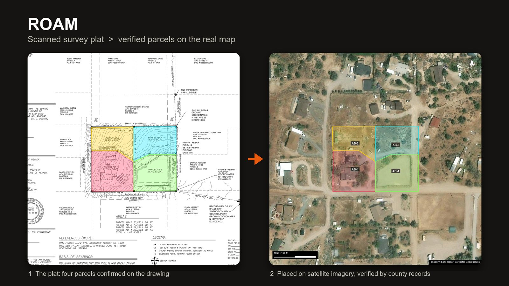

</div>

## What is ROAM

Land records are still mostly scanned PDFs. A typical packet has a deed, application forms, tables and one or two survey plats with the actual parcel drawing. To use any of it in GIS, someone has to find the right drawing, trace the parcels, work out the scale and orientation, and place them at the correct spot on the map. The hard part is the location: drawings are not to a known scale, printed coordinates come in different systems, parcel numbers get renumbered, and labels are blurred in scans.

ROAM does this end to end. You upload a PDF, confirm each parcel's outline on the drawing, and ROAM works out the scale, places the parcels on satellite imagery, and checks the location against independent evidence. Every parcel gets a clear status: **verified**, **approximate** or **needs review**. It would rather say "not sure" than show a confident wrong answer.

**Output:** parcel polygons with area, perimeter and closure checks, and a full GIS deliverable: PDF report, GeoJSON, KML, shapefiles (WGS 84 and NAD83 state plane) and CSV tables.

## How it works

### 1. Read any scan

Every page is rendered and run through a custom trained YOLO layout model that finds parcel maps, text blocks, tables, seals and pictures. Each sheet is then judged: is it the target parcel map, a reference survey, or just a location map. OCR (PaddleOCR) and Gemini read the parcel labels, printed areas, bearings, neighbour APNs and coordinates.

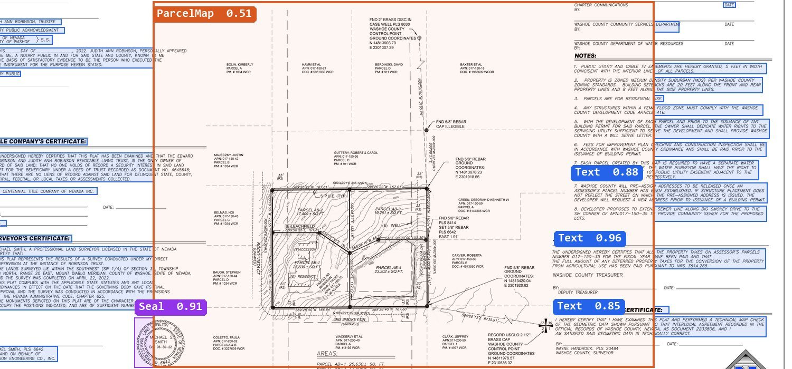

### 2. Confirm the boundary

The user outlines each parcel on the drawing in a fast editor: draw corners, drag a rectangle, fill a closed area with one click, move or rotate, snap to neighbouring parcels, undo and redo. This one human step is why the shapes are reliable.

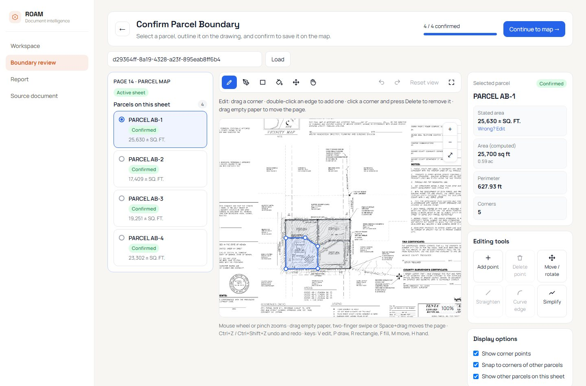

### 3. Calibrate and place

A background job works out the drawing's scale from the printed areas and edge lengths, checks the orientation from printed bearings, and places the parcels. Then it tries to prove the location with independent evidence.

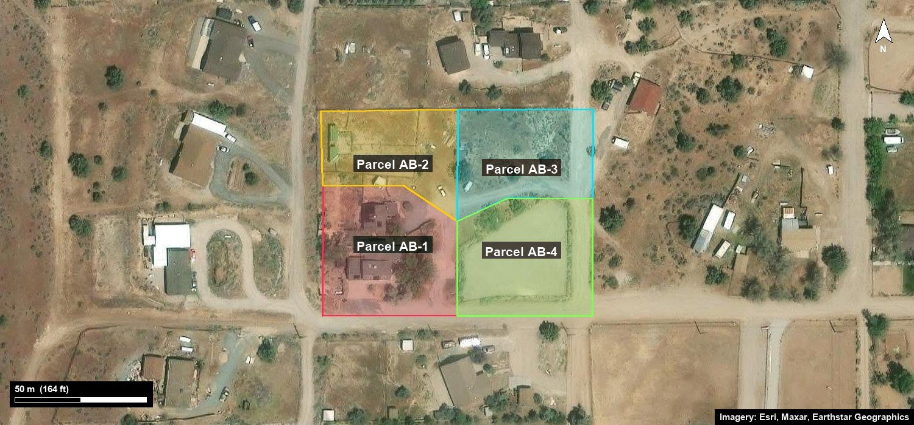

| Evidence | How ROAM uses it |
| --- | --- |
| Printed state-plane coordinates | Converted in every zone of the state; only a conversion that agrees with the other evidence is kept. Ground coordinates are scaled to grid first. |
| PLSS description | Township, range and section looked up in BLM's public land survey data. |
| Neighbour APNs | Looked up in the county's parcel records; the outlines are slid into the gap between the neighbours, with no overlap and edges touching. Counted only if no rival position fits almost as well. |
| Survey control points | Read off the sheet with OCR and bound to the matching parcel corners. |
| Satellite imagery | Used by the AI review to line the parcels up with the roads and canals the plat draws around them. |

### 4. AI placement review

When a placement looks wrong, the user describes the problem in their own words. An LLM agent investigates with tools written for ROAM (read the evidence, convert coordinates, look up county parcels, test a position, compare the plat with the imagery) and the panel shows each step live. The agent never changes anything by itself: it proposes a fix, shown as a dashed outline on the map, and the user applies it.

| Before: placed from a street address only | After: lined up with the road and canal the plat names |
| :---: | :---: |
| 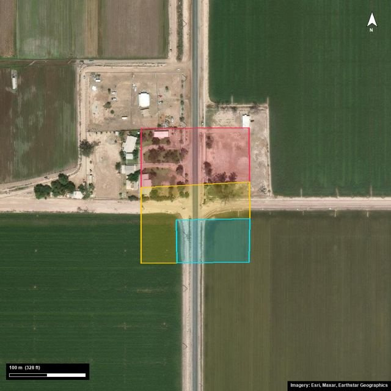 | 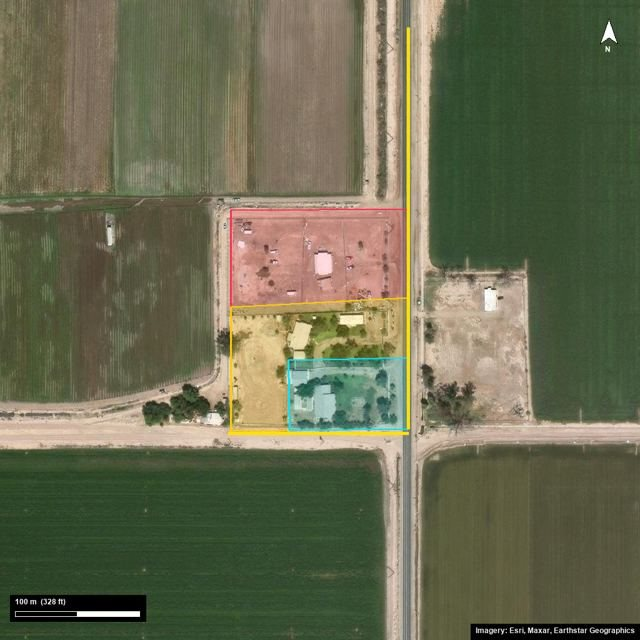 |

The vision model only **points** at the road and canal; the move in metres is **measured** from the known image scale. Vision models find things well but estimate distances badly.

### 5. Review and export

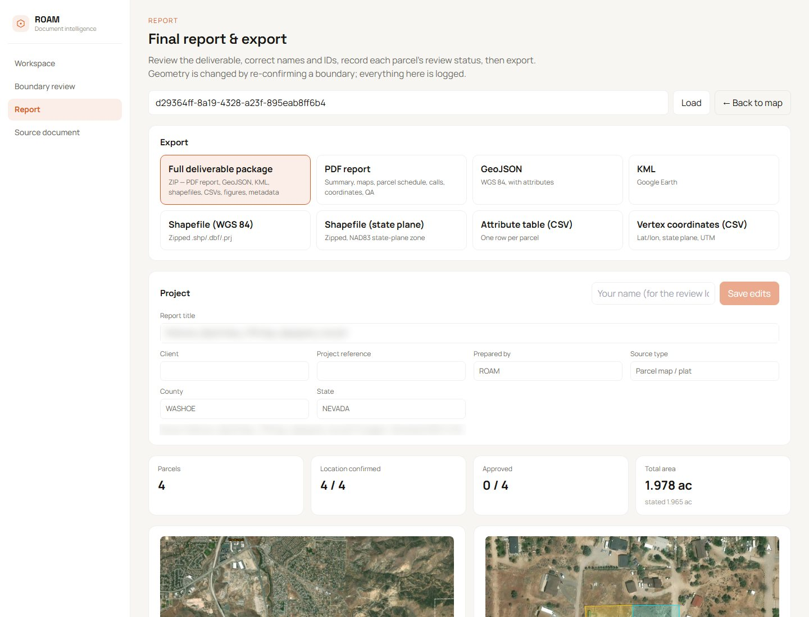

## Screens

| Sample gallery | Workspace map |
| :---: | :---: |
| 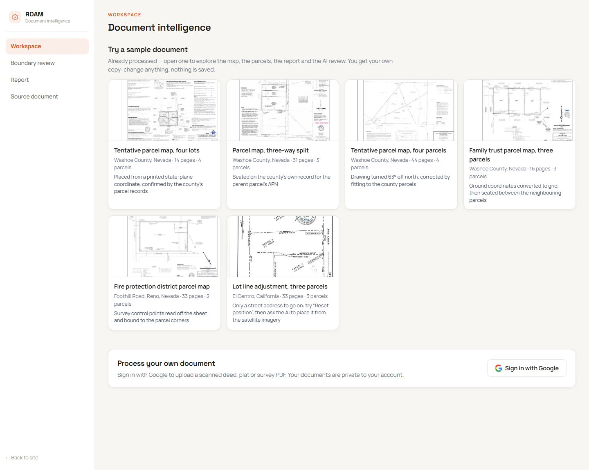 | 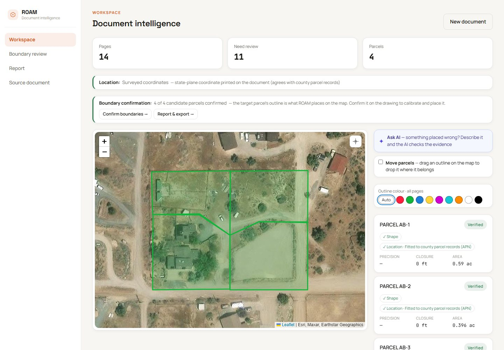 |
| **Source document with page roles** | **Boundary editor** |
| 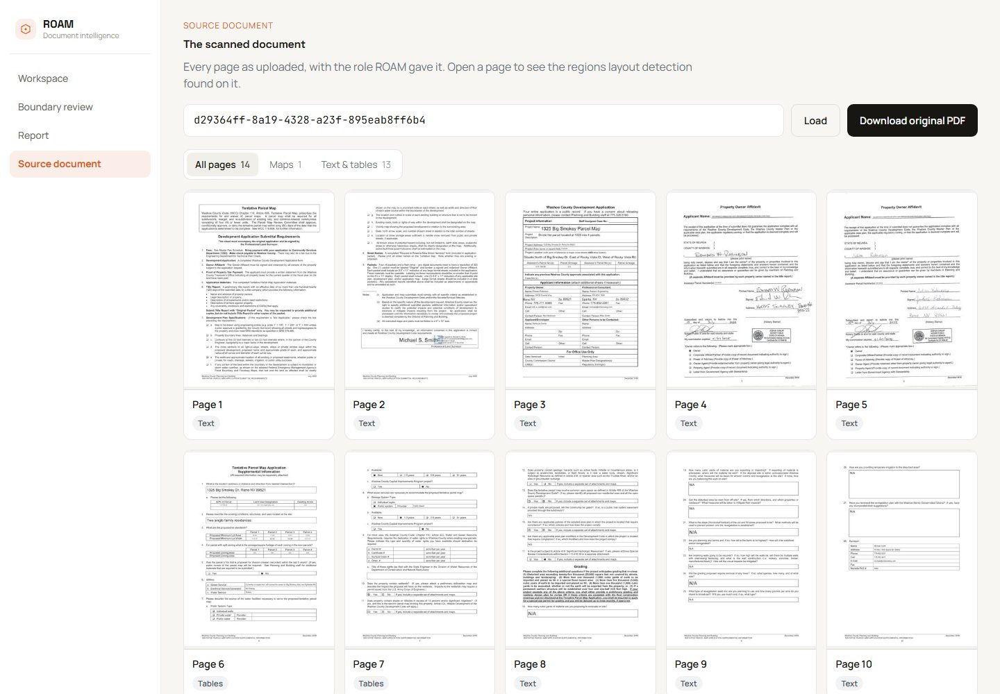 |  |

Visitors can open any of the processed samples without signing in. Each sample opens as a private copy, so they can move parcels, re-confirm boundaries and run the AI review, and nothing is saved. Uploading your own PDF needs Google sign-in, and documents stay private to the account.

## Engineering highlights

- **A 900 m error from one missing factor.** A plat printed ground coordinates with a combined factor, but OCR garbled the factor, so verification dropped it and the sheet landed 900 m north. The check now accepts the factor when OCR shows its leading significant digits.
- **Placement search from 9 minutes to about 20 seconds.** Fitting parcels between county neighbours tested about 10,000 positions per rotation with polygon intersections. A raster version scores every shift at once with one cross-correlation and one distance transform, then refines exactly only where it matters. Results were identical on all 15 test documents.
- **One misread bearing can no longer turn a sheet.** A rotation backed by a single printed bearing may only make a small turn; larger turns are left to fits that work out rotation themselves. Verified on every affected document before switching it on.
- **Stale records and blurred labels.** Renumbered APNs are detected and ignored; a parcel whose printed area was misread borrows the scale of a strongly verified parcel on the same sheet.

## Architecture

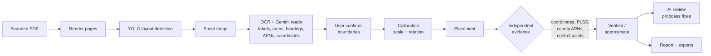

| Part | Stack |
| --- | --- |
| Frontend | SvelteKit, Leaflet with Esri satellite imagery, custom canvas boundary editor |
| Backend | Python 3.11, FastAPI, background verification jobs, streaming responses |
| Document understanding | Custom YOLO layout model, PaddleOCR, Gemini |
| Geometry | Shapely, pyproj (state plane, UTM), NumPy, OpenCV |
| Public data | County ArcGIS parcel service (Washoe County, NV), BLM PLSS, geocoding |
| AI agent | LLM with tool calling through OpenRouter, Gemini vision for plat and imagery |
| Accounts | Google sign-in, signed session tokens, per-document access rules |
| Exports | PDF report, GeoJSON, KML, shapefiles (WGS 84, NAD83 state plane), CSV |

## Project structure

```
app/
  main.py              FastAPI app and the document access gate
  routes/              documents, account (sign-in, samples), ask
  pipeline/            document pipeline: render, layout, triage, OCR, anchor
  services/            calibration, placement, county APNs, control points,
                       location evidence, report and exports, AI agent and tools
  templates/           PDF report template
frontend/
  src/routes/          landing page, workspace, boundary review, report, source document
  src/lib/             AI review panel, auth, shared components
data/samples.json      the sample gallery
tests/                 189 tests
```

## Run it locally

**Requirements:** Python 3.11, Node 20+, and API keys for Gemini (and optionally OpenRouter for the AI review and a Google OAuth client for sign-in).

```bash
# backend
python -m venv roam-env
roam-env/Scripts/pip install -r requirements.txt    # on macOS / Linux: roam-env/bin/pip
cp .env.example .env                                  # then fill in the keys
roam-env/Scripts/uvicorn app.main:app --reload --port 8000

# frontend
cd frontend
npm install
npm run dev                                           # http://localhost:5173
```

Settings in `.env`:

| Variable | Purpose |
| --- | --- |
| `GEMINI_API_KEY` | Reading labels, bearings, location evidence and imagery |
| `OPENROUTER_API_KEY` | The AI placement review agent |
| `GOOGLE_CLIENT_ID` | Google sign-in (OAuth web client) |
| `SESSION_SECRET` | Signs session tokens |
| `ADMIN_EMAILS` | Accounts allowed to change the shared samples |

Run the tests with `python -m pytest`.

## Author

**Aryan Kathpalia**, design and development.
